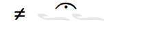

[cols=9*,options=header]

|===
|Sub-Font
|Char
|ImagePreview
|Shorthand
|Shorthand Alt
|Proper
|Proper Conditionals
|Proper + Full Pos
|Notes

|Main
|A
|image:ka_fontimages/main-capital-A.png[]
|klasD
|
|klasD
|
|
|

|
|a
|image:ka_fontimages/main-a.png[]
|klas
|
|klasU
|
|
|

|
|D
|image:ka_fontimages/main-capital-D.png[]
|hapl
|
|haplD
|
|
|Notice that there is no haple for ison/oligon. This haple goes under an apostrofos or hyporroe.

|
|d
|image:ka_fontimages/main-d.png[]
|klasL
|
|klasU
|if after ison or cham
|
|

|
|F
|image:ka_fontimages/main-capital-F.png[]
|diplR
|
|diplD
|if after apos
|
|

|
|f
|image:ka_fontimages/main-f.png[]
|dipl
|
|diplD
|
|
|

|
|G
|image:ka_fontimages/main-capital-G.png[]
|tripR
|
|tripD
|if after apos
|
|

|
|g
|image:ka_fontimages/main-g.png[]
|trip
|
|tripD
|
|
|

|
|H
|image:ka_fontimages/main-capital-H.png[]
|tetrR
|
|tetrD
|if after apos
|
|

|
|h
|image:ka_fontimages/main-h.png[]
|tetr
|
|tetrD
|
|
|

|
|J
|image:ka_fontimages/main-capital-J.png[]
|antiD2
|
|antiD2
|
|
|

|
|j
|image:ka_fontimages/main-j.png[]
|anti
|
|antiD
|
|
|

|
|K
|image:ka_fontimages/main-capital-K.png[]
|akaplD2
|
|antiD2-hapl
|
|
|

|
|k
|image:ka_fontimages/main-k.png[]
|akapl
|
|antiD-hapl
|
|
|

|
|l
|image:ka_fontimages/main-l.png[]
|akaplR
|
|anti-hapl
|if after apos
|
|

|
|M
|image:ka_fontimages/main-capital-M.png[]
|psklasR
|
|klasD-psefD2
|if after peta
|
|

|
|m
|image:ka_fontimages/main-m.png[]
|psklas
|
|klasD-psefD2
|klasD-psefD2 ligature
|
|Simple ligature for better looking combination of klas and psef

|
|N
|image:ka_fontimages/main-capital-N.png[]
|psefD2
|
|psefD2
|
|
|

|
|n
|image:ka_fontimages/main-n.png[]
|psef
|
|psef
|
|
|

|
|S
|image:ka_fontimages/main-capital-S.png[]
|klasDR
|
|klasDR
|if after peta
|
|

|
|s
|image:ka_fontimages/main-s.png[]
|klasR
|
|klasR
|if after apos
|
|

|
|[
|image:ka_fontimages/main-left-bracket.png[]
|hete
|
|heteD
|
|
|

|
|]
|image:ka_fontimages/main-right-bracket.png[]
|endo
|
|endoD
|
|
|

|
|{
|image:ka_fontimages/main-left-curly-bracket.png[]
|heteD2
|
|heteD2
|if after peta, olig-kentD, or olig-ken2D
|
|

|
|\|
|image:ka_fontimages/main-pipe.png[]
|barlU
|
|barlU
|
|
|Will probably only appear after olig-ken2U, but this isn't a ligature or substitution (must be asked for explicitly).

|
|}
|image:ka_fontimages/main-right-curly-bracket.png[]
|barlUL
|
|barlU
|barlU if after syne
|
|

|
|~
|image:ka_fontimages/main-tilde.png[]
|kent
|
|kent
|
|
|

|
|«
|image:ka_fontimages/main-left-double-caret.png[]
|barlUR
|
|barlUR
|barlU if after apos
|
|This is my best guess at where this came from. Not sure if this is an old leftover neume that should be deleted, or if it was intended to be placed over a specific neume.

|
|å
|image:ka_fontimages/main-a-ring.png[]
|klasU1.1L0.9
|
|klasU
|if after elaf apel, or syne
|
|

|
|ƒ
|image:ka_fontimages/main-florin.png[]
|diplDR1.5
|
|diplD
|if after elaf, apel, or chame
|
|

|
|˚
|image:ka_fontimages/main-alternate-degree-sign.png[]
|akaplD1.5
|
|antiD
|if after vare-peta
|
|

|
|‘
|image:ka_fontimages/main-left-single-quote.png[]
|spsef
|
|psef
|if after heteD
|
|Seperated from heteD so that hete can be colored red. Note: this is not aligned for heteD2.

|
|“
|image:ka_fontimages/main-left-double-quote.png[]
|heteD2R2
|
|heteD2
|if after apos
|
|

|
|”
|image:ka_fontimages/main-right-double-quote.png[]
|heteD3
|
|heteD3
|if after olig-kenD or olig-ken2D
|
|

|
|∂
|image:ka_fontimages/main-derivative.png[]
|haplDR
|
|haplDR
|if after hypo
|
|

|
|≠
|
|coroL
|
|coroL
|
|
|

|
|'
|image:ka_fontimages/main-single-quote.png[]
|homa
|
|homaD
|
|
|

|
|"
|image:ka_fontimages/main-double-quote.png[]
|homaD2
|
|homaD2
|
|
|

|
|:
|image:ka_fontimages/main-colon.png[]
|homaD2R
|
|homaD2R
|
|
|

|
|;
|image:ka_fontimages/main-semicolon.png[]
|homaR
|
|homaDR
|
|
|

|
|B
|image:ka_fontimages/main-capital-B.png[]
|lpsef
|
|psef
|if after long oligon
|
|Long oligon no longer exists.

|
|C
|image:ka_fontimages/main-capital-C.png[]
|olig-apelUL-ken2UR
|
|olig-apelUL-ken2UR
|
|
|

|
|E
|image:ka_fontimages/main-capital-E.png[]
|peta-apelU
|
|peta-apelU
|
|
|

|
|I
|image:ka_fontimages/main-capital-I.png[]
|peta-chamU-chamU2
|
|peta-chamU-chamU2
|
|
|

|
|L
|image:ka_fontimages/main-capital-L.png[]
|apo2
|
|apo2
|optional ligature for apos apos
|
|This combination is optional for saving space on a page. Note that this is two consecutive apostrophoi (apos apos), not one base nueme with another below it (apos-aposD).

|
|O
|image:ka_fontimages/main-capital-O.png[]
|peta-aposU-chamU2-chamU3
|
|peta-aposU-chamU2-chamU3
|
|
|We haven't planned for 3rd level, but we need it for this combo.

|
|P
|image:ka_fontimages/main-capital-P.png[]
|ison-aposD
|
|ison-aposD
|optional ligature for ison apos
|
|See note for apo2 (apos apos).

|
|Q
|image:ka_fontimages/main-capital-Q.png[]
|peta-aposU
|
|peta-aposU
|
|
|

|
|R
|image:ka_fontimages/main-capital-R.png[]
|peta-chamU
|
|peta-chamU
|
|
|

|
|T
|image:ka_fontimages/main-capital-T.png[]
|peta-aposU-chamU2
|
|peta-aposU-chamU2
|
|
|

|
|U
|image:ka_fontimages/main-capital-U.png[]
|peta-apelU-chamU2
|
|peta-apelU-chamU2
|
|
|

|
|V
|image:ka_fontimages/main-capital-V.png[]
|olig-syneUL-ken2UR
|
|olig-syneUL-ken2UR
|
|
|

|
|W
|image:ka_fontimages/main-capital-W.png[]
|peta-elafU
|
|peta-elafU
|
|
|

|
|X
|image:ka_fontimages/main-capital-X.png[]
|olig-aposUL-ken2UR
|
|olig-aposUL-ken2UR
|
|
|

|
|Y
|image:ka_fontimages/main-capital-Y.png[]
|peta-elafU-chamU2
|
|peta-elafU-chamU2
|
|
|

|
|Z
|image:ka_fontimages/main-capital-Z.png[]
|olig-ken2U
|
|olig-ken2U
|
|
|

|
|b
|image:ka_fontimages/main-b.png[]
|olig-chamUL-ken2UR
|
|olig-chamUL-ken2UR
|
|
|

|
|c
|image:ka_fontimages/main-c.png[]
|olig-elafUL-ken2UR
|
|olig-elafUL-ken2UR
|
|
|

|
|e
|image:ka_fontimages/main-e.png[]
|peta-kentU
|
|peta-kentU
|
|
|

|
|i
|image:ka_fontimages/main-i.png[]
|peta-hypsUL-hypsUR
|
|peta-hypsUL-hypsUR
|
|
|

|
|o
|image:ka_fontimages/main-o.png[]
|peta-kentU-hypsUR-hypsU2
|
|peta-kentU-hypsUR-hypsU2
|
|
|

|
|p
|image:ka_fontimages/main-p.png[]
|peta-isonU
|
|peta-isonU
|
|
|

|
|q
|image:ka_fontimages/main-q.png[]
|peta
|
|peta
|
|
|

|
|r
|image:ka_fontimages/main-r.png[]
|peta-hypsUR
|
|peta-hypsUR
|
|
|

|
|t
|image:ka_fontimages/main-t.png[]
|peta-hypsUL
|
|peta-hypsUL
|
|
|

|
|u
|image:ka_fontimages/main-u.png[]
|peta-kentU-hypsU2
|
|peta-kentU-hypsU2
|
|
|

|
|v
|image:ka_fontimages/main-v.png[]
|olig-hypoUL-ken2UR
|
|olig-hypoUL-ken2UR
|
|
|

|
|w
|image:ka_fontimages/main-w.png[]
|peta-oligU
|
|peta-oligU
|
|
|

|
|x
|image:ka_fontimages/main-x.png[]
|olig-isonUL-ken2UR
|
|olig-isonUL-ken2UR
|
|
|

|
|y
|image:ka_fontimages/main-y.png[]
|peta-kentU-hypsUR
|
|peta-kentU-hypsUR
|
|
|

|
|z
|image:ka_fontimages/main-z.png[]
|olig-ken2DR
|
|olig-ken2DR
|
|
|

|
|Ω
|image:ka_fontimages/main-capital-omega.png[]
|olig-ken2D-psefD2
|
|olig-ken2D-psefD2
|substitue olig-ken2D for this if psef will follow
|
|Could be combined in TTF as ligature of olig-ken2D-psef, but kept separate for more freedom in coloring.

|
|™
|image:ka_fontimages/main-trademark.png[]
|olig-kentDR
|
|olig-kentDR
|
|
|

|
|0
|image:ka_fontimages/main-0.png[]
|ison
|
|ison
|
|
|

|
|1
|image:ka_fontimages/main-1.png[]
|olig
|
|olig
|
|
|

|
|2
|image:ka_fontimages/main-2.png[]
|olig-kentD
|
|olig-kentD
|substitute olig-kentD for this if psef will follow
|
|

|
|3
|image:ka_fontimages/main-3.png[]
|olig-kentU
|
|olig-kentU
|
|
|

|
|4
|image:ka_fontimages/main-4.png[]
|olig-hypsUR
|
|olig-hypsUR
|
|
|

|
|5
|image:ka_fontimages/main-5.png[]
|olig-hypsUL
|
|olig-hypsUL
|
|
|

|
|6
|image:ka_fontimages/main-6.png[]
|olig-kentU-hypsUR
|
|olig-kentU-hypsUR
|
|
|

|
|7
|image:ka_fontimages/main-7.png[]
|olig-kentU-hypsU2
|
|olig-kentU-hypsU2
|
|
|

|
|8
|image:ka_fontimages/main-8.png[]
|olig-hypsUL-hypsUR
|
|olig-hypsUL-hypsUR
|
|
|

|
|9
|image:ka_fontimages/main-9.png[]
|olig-kentU-hypsUR-hypsU2
|
|olig-kentU-hypsUR-hypsU2
|
|
|

|
|!
|image:ka_fontimages/main-exclamation-point.png[]
|apos
|
|apos
|
|
|

|
|@
|image:ka_fontimages/main-at-sign.png[]
|elaf
|
|elaf
|
|
|

|
|#
|image:ka_fontimages/main-number-sign.png[]
|apel
|
|apel
|
|
|technically elaf-aposD, but it's unlikely a font would try to build this manually

|
|$
|image:ka_fontimages/main-dollarsign.png[]
|cham
|
|cham
|
|
|

|
|%
|image:ka_fontimages/main-percent-sign.png[]
|apos-chamU
|
|apos-chamU
|
|
|

|
|^
|image:ka_fontimages/main-up-caret.png[]
|elaf-chamU
|
|elaf-chamU
|
|
|

|
|&
|image:ka_fontimages/main-ampersand.png[]
|apel-chamU
|
|apel-chamU
|
|
|

|
|*
|image:ka_fontimages/main-asterisk.png[]
|cham-chamU
|
|cham-chamU
|
|
|

|
|(
|image:ka_fontimages/main-left-paren.png[]
|apos-chamU-chamU2
|
|apos-chamU-chamU2
|
|
|

|
|-
|image:ka_fontimages/main-hyphen.png[]
|hypo
|
|hypo
|
|
|

|
|_
|image:ka_fontimages/main-underscore.png[]
|syne
|
|syne
|
|
|

|
|`
|image:ka_fontimages/main-grave.png[]
|ken2
|
|ken2
|
|
|

|
|+
|image:ka_fontimages/main-plus.png[]
|stav
|
|stav
|
|
|

|
|=
|image:ka_fontimages/main-equal-sign.png[]
|brea
|
|brea
|
|
|

|
|<
|image:ka_fontimages/main-left-caret.png[]
|vare-dipl
|
|vare-dipl
|
|
|

|
|,
|image:ka_fontimages/main-comma.png[]
|vare-hapl
|
|vare-hapl
|
|
|

|
|>
|image:ka_fontimages/main-right-caret.png[]
|vare-tetr
|
|vare-tetr
|
|
|

|
|.
|image:ka_fontimages/main-period.png[]
|vare-trip
|
|vare-trip
|
|
|

|
|/
|image:ka_fontimages/main-slash.png[]
|vare
|
|vare
|
|
|

|
|?
|image:ka_fontimages/main-question-mark.png[]
|vare-hapl-gorg
|
|vare-hapl-gorg
|
|
|

|
|\
|image:ka_fontimages/main-backslash.png[]
|barl
|
|barl
|
|
|

|
|
|
|
|
|
|
|
|

|Martyria
|!
|image:ka_fontimages/martyria-exclamation-point.png[]
|mpaU
|
|
|
|
|

|
|#
|image:ka_fontimages/martyria-number-sign.png[]
|mgaU
|
|
|
|
|

|
|$
|image:ka_fontimages/martyria-dollarsign.png[]
|mdiU
|
|
|
|
|

|
|%
|image:ka_fontimages/martyria-percent-sign.png[]
|mkeU
|
|
|
|
|

|
|&
|image:ka_fontimages/martyria-ampersand.png[]
|mneU
|
|
|
|
|

|
|,
|image:ka_fontimages/martyria-comma.png[]
|chronf3
|
|
|
|
|

|
|/
|image:ka_fontimages/martyria-slash.png[]
|plagal
|
|
|
|
|

|
|1
|image:ka_fontimages/martyria-1.png[]
|mpa
|
|
|
|
|

|
|2
|image:ka_fontimages/martyria-2.png[]
|mvou
|
|
|
|
|

|
|3
|image:ka_fontimages/martyria-3.png[]
|mga
|
|
|
|
|

|
|4
|image:ka_fontimages/martyria-4.png[]
|mdi
|
|
|
|
|

|
|5
|image:ka_fontimages/martyria-5.png[]
|mke
|
|
|
|
|

|
|6
|image:ka_fontimages/martyria-6.png[]
|mzo
|
|
|
|
|

|
|7
|image:ka_fontimages/martyria-7.png[]
|mne
|
|
|
|
|

|
|<
|image:ka_fontimages/martyria-left-caret.png[]
|chronf3U
|
|
|
|
|

|
|@
|image:ka_fontimages/martyria-at-sign.png[]
|mvouU
|
|
|
|
|

|
|A
|image:ka_fontimages/martyria-capital-A.png[]
|mbetaU
|
|
|
|
|

|
|B
|image:ka_fontimages/martyria-capital-B.png[]
|chronmU
|
|
|
|
|

|
|C
|image:ka_fontimages/martyria-capital-C.png[]
|chrons2U
|
|
|
|
|

|
|D
|image:ka_fontimages/martyria-capital-D.png[]
|mscbetaU
|
|
|
|
|

|
|E
|image:ka_fontimages/martyria-capital-E.png[]
|mnanaU
|
|
|
|
|

|
|F
|image:ka_fontimages/martyria-capital-F.png[]
|mscnenanoU
|
|
|
|
|

|
|G
|image:ka_fontimages/martyria-capital-G.png[]
|zygosC
|
|
|
|
|

|
|H
|image:ka_fontimages/martyria-capital-H.png[]
|klitonC
|
|
|
|
|

|
|I
|image:ka_fontimages/martyria-capital-I.png[]
|plfirst
|
|
|
|
|

|
|J
|image:ka_fontimages/martyria-capital-J.png[]
|spathiC
|
|
|
|
|

|
|M
|image:ka_fontimages/martyria-capital-M.png[]
|chronf2U
|
|
|
|
|

|
|N
|image:ka_fontimages/martyria-capital-N.png[]
|chronfU
|
|
|
|
|

|
|O
|image:ka_fontimages/martyria-capital-O.png[]
|plsecondsc
|
|
|
|
|

|
|P
|image:ka_fontimages/martyria-capital-P.png[]
|gravemode
|
|
|
|
|

|
|Q
|image:ka_fontimages/martyria-capital-Q.png[]
|malphaU
|
|
|
|
|

|
|R
|image:ka_fontimages/martyria-capital-R.png[]
|mdeltaapoU
|
|
|
|
|

|
|S
|image:ka_fontimages/martyria-capital-S.png[]
|mnenanoU
|
|
|
|
|

|
|T
|image:ka_fontimages/martyria-capital-T.png[]
|malphaapoU
|
|
|
|
|

|
|U
|image:ka_fontimages/martyria-capital-U.png[]
|mdeltaU
|
|
|
|
|

|
|V
|image:ka_fontimages/martyria-capital-V.png[]
|chronsU
|
|
|
|
|

|
|W
|image:ka_fontimages/martyria-capital-W.png[]
|mlamdaU
|
|
|
|
|

|
|X
|image:ka_fontimages/martyria-capital-X.png[]
|chrons3U
|
|
|
|
|

|
|Y
|image:ka_fontimages/martyria-capital-Y.png[]
|mhypoU
|
|
|
|
|

|
|Z
|image:ka_fontimages/martyria-capital-Z.png[]
|chrons4U
|
|
|
|
|

|
|[
|image:ka_fontimages/martyria-left-bracket.png[]
|fourthmode
|
|
|
|
|

|
|^
|image:ka_fontimages/martyria-up-caret.png[]
|mzoU
|
|
|
|
|

|
|`
|image:ka_fontimages/martyria-grave.png[]
|mtonos
|
|
|
|
|

|
|a
|image:ka_fontimages/martyria-a.png[]
|mbeta
|
|
|
|
|

|
|b
|image:ka_fontimages/martyria-b.png[]
|chronm
|
|
|
|
|

|
|c
|image:ka_fontimages/martyria-c.png[]
|chrons2
|
|
|
|
|

|
|d
|image:ka_fontimages/martyria-d.png[]
|mscbeta
|
|
|
|
|

|
|e
|image:ka_fontimages/martyria-e.png[]
|mnana
|
|
|
|
|

|
|f
|image:ka_fontimages/martyria-f.png[]
|mscnenano
|
|
|
|
|

|
|g
|image:ka_fontimages/martyria-g.png[]
|zygos
|
|
|
|
|

|
|h
|image:ka_fontimages/martyria-h.png[]
|kliton
|
|
|
|
|

|
|i
|image:ka_fontimages/martyria-i.png[]
|firstmode
|
|
|
|
|

|
|j
|image:ka_fontimages/martyria-j.png[]
|spathi
|
|
|
|
|

|
|m
|image:ka_fontimages/martyria-m.png[]
|chronf2
|
|
|
|
|

|
|n
|image:ka_fontimages/martyria-n.png[]
|chronf
|
|
|
|
|

|
|o
|image:ka_fontimages/martyria-o.png[]
|secondmode
|
|
|
|
|

|
|p
|image:ka_fontimages/martyria-p.png[]
|thirdmodenana
|
|
|
|
|

|
|q
|image:ka_fontimages/martyria-q.png[]
|malpha
|
|
|
|
|

|
|r
|image:ka_fontimages/martyria-r.png[]
|mdeltaapo
|
|
|
|
|

|
|s
|image:ka_fontimages/martyria-s.png[]
|mnenano
|
|
|
|
|

|
|t
|image:ka_fontimages/martyria-t.png[]
|malphaapo
|
|
|
|
|

|
|u
|image:ka_fontimages/martyria-u.png[]
|mdelta
|
|
|
|
|

|
|v
|image:ka_fontimages/martyria-v.png[]
|chrons
|
|
|
|
|

|
|w
|image:ka_fontimages/martyria-w.png[]
|mlamda
|
|
|
|
|

|
|x
|image:ka_fontimages/martyria-x.png[]
|chrons3
|
|
|
|
|

|
|y
|image:ka_fontimages/martyria-y.png[]
|mhypo
|
|
|
|
|

|
|z
|image:ka_fontimages/martyria-z.png[]
|chrons4
|
|
|
|
|

|
|{
|image:ka_fontimages/martyria-left-curly-bracket.png[]
|plfourth
|
|
|
|
|

|
|~
|image:ka_fontimages/martyria-tilde.png[]
|mtonosU
|
|
|
|
|

|
|π
|image:ka_fontimages/martyria-pi.png[]
|thirdmode
|
|
|
|
|

|
|“
|image:ka_fontimages/martyria-left-double-quote.png[]
|legetos
|
|
|
|
|

|
|
|
|
|
|
|
|
|

|Fthora
|!
|image:ka_fontimages/fthora-exclamation-point.png[]
|indicatepaR
|
|
|
|
|

|
|"
|image:ka_fontimages/fthora-double-quote.png[]
|sharp2R
|
|
|
|
|

|
|#
|image:ka_fontimages/fthora-number-sign.png[]
|indicategaR
|
|
|
|
|

|
|$
|image:ka_fontimages/fthora-dollarsign.png[]
|indicatediR
|
|
|
|
|

|
|%
|image:ka_fontimages/fthora-percent-sign.png[]
|indicatekeR
|
|
|
|
|

|
|&
|image:ka_fontimages/fthora-ampersand.png[]
|indicateniR
|
|
|
|
|

|
|'
|image:ka_fontimages/fthora-single-quote.png[]
|sharp2
|
|
|
|
|

|
|+
|image:ka_fontimages/fthora-plus.png[]
|sharpR
|
|
|
|
|

|
|,
|image:ka_fontimages/fthora-comma.png[]
|permflat
|
|
|
|
|

|
|-
|image:ka_fontimages/fthora-hyphen.png[]
|flat
|
|
|
|
|

|
|.
|image:ka_fontimages/fthora-period.png[]
|permsharp
|
|
|
|
|

|
|1
|image:ka_fontimages/fthora-1.png[]
|indicatepaL
|
|
|
|
|

|
|2
|image:ka_fontimages/fthora-2.png[]
|indicatevouL
|
|
|
|
|

|
|3
|image:ka_fontimages/fthora-3.png[]
|indicategaL
|
|
|
|
|

|
|4
|image:ka_fontimages/fthora-4.png[]
|indicatediL
|
|
|
|
|

|
|5
|image:ka_fontimages/fthora-5.png[]
|indicatekeL
|
|
|
|
|

|
|6
|image:ka_fontimages/fthora-6.png[]
|indicatezoL
|
|
|
|
|

|
|7
|image:ka_fontimages/fthora-7.png[]
|indicateneL
|
|
|
|
|

|
|:
|image:ka_fontimages/fthora-colon.png[]
|flat2R
|
|
|
|
|

|
|;
|image:ka_fontimages/fthora-semicolon.png[]
|flat2
|
|
|
|
|

|
|<
|image:ka_fontimages/fthora-left-caret.png[]
|permflatD
|
|
|
|
|

|
|=
|image:ka_fontimages/fthora-equal-sign.png[]
|sharp
|
|
|
|
|

|
|>
|image:ka_fontimages/fthora-right-caret.png[]
|permsharpD
|
|
|
|
|

|
|@
|image:ka_fontimages/fthora-at-sign.png[]
|indicatevouR
|
|
|
|
|

|
|A
|image:ka_fontimages/fthora-capital-A.png[]
|fthorahardchromaticpaDR
|
|
|
|
|

|
|D
|image:ka_fontimages/fthora-capital-D.png[]
|fthorasoftchromaticdiDR
|
|
|
|
|

|
|E
|image:ka_fontimages/fthora-capital-E.png[]
|fthoradiatonicgaDR
|
|
|
|
|

|
|F
|image:ka_fontimages/fthora-capital-F.png[]
|fthorasoftchromatickeDR
|
|
|
|
|

|
|G
|image:ka_fontimages/fthora-capital-G.png[]
|chroizygosDR
|
|
|
|
|

|
|H
|image:ka_fontimages/fthora-capital-H.png[]
|chroiklitonDR
|
|
|
|
|

|
|I
|image:ka_fontimages/fthora-capital-I.png[]
|fthoradiatonicniDR
|
|
|
|
|

|
|J
|image:ka_fontimages/fthora-capital-J.png[]
|chroispathiDR
|
|
|
|
|

|
|K
|image:ka_fontimages/fthora-capital-K.png[]
|fthoraajemDR
|
|
|
|
|

|
|Q
|image:ka_fontimages/fthora-capital-Q.png[]
|fthoradiatonicpaDR
|
|
|
|
|

|
|R
|image:ka_fontimages/fthora-capital-R.png[]
|fthoradiatonicdiDR
|
|
|
|
|

|
|S
|image:ka_fontimages/fthora-capital-S.png[]
|fthorahardchromaticdiDR
|
|
|
|
|

|
|T
|image:ka_fontimages/fthora-capital-T.png[]
|fthoradiatonickeDR
|
|
|
|
|

|
|U
|image:ka_fontimages/fthora-capital-U.png[]
|fthoradiatonichighniDR
|
|
|
|
|

|
|W
|image:ka_fontimages/fthora-capital-W.png[]
|fthoradiatonicvouDR
|
|
|
|
|

|
|Y
|image:ka_fontimages/fthora-capital-Y.png[]
|fthoradiatonichighzoDR
|
|
|
|
|

|
|[
|image:ka_fontimages/fthora-left-bracket.png[]
|flat1
|
|
|
|
|

|
|]
|image:ka_fontimages/fthora-right-bracket.png[]
|sharp1
|
|
|
|
|

|
|^
|image:ka_fontimages/fthora-up-caret.png[]
|indicatezoR
|
|
|
|
|

|
|+
|image:ka_fontimages/fthora-plus.png[]
|flatR
|
|
|
|
|

|
|a
|image:ka_fontimages/fthora-a.png[]
|fthorahardchromaticpaU
|
|
|
|
|

|
|d
|image:ka_fontimages/fthora-d.png[]
|fthorasoftchromaticdiU
|
|
|
|
|

|
|e
|image:ka_fontimages/fthora-e.png[]
|fthoradiatonicgaU
|
|
|
|
|

|
|f
|image:ka_fontimages/fthora-f.png[]
|fthorasoftchromatickeU
|
|
|
|
|

|
|g
|image:ka_fontimages/fthora-g.png[]
|chroizygosU
|
|
|
|
|

|
|h
|image:ka_fontimages/fthora-h.png[]
|chroiklitonU
|
|
|
|
|

|
|i
|image:ka_fontimages/fthora-i.png[]
|fthoradiatonicniU
|
|
|
|
|

|
|j
|image:ka_fontimages/fthora-j.png[]
|chroispathiU
|
|
|
|
|

|
|k
|image:ka_fontimages/fthora-k.png[]
|fthoraajemU
|
|
|
|
|

|
|q
|image:ka_fontimages/fthora-q.png[]
|fthoradiatonicpaU
|
|
|
|
|

|
|r
|image:ka_fontimages/fthora-r.png[]
|fthoradiatonicdiU
|
|
|
|
|

|
|s
|image:ka_fontimages/fthora-s.png[]
|fthorahardchromaticdiU
|
|
|
|
|

|
|t
|image:ka_fontimages/fthora-t.png[]
|fthoradiatonickeU
|
|
|
|
|

|
|u
|image:ka_fontimages/fthora-u.png[]
|fthoradiatonichighniU
|
|
|
|
|

|
|w
|image:ka_fontimages/fthora-w.png[]
|fthoradiatonicvouU
|
|
|
|
|

|
|y
|image:ka_fontimages/fthora-y.png[]
|fthoradiatonichighzoU
|
|
|
|
|

|
|{
|image:ka_fontimages/fthora-left-curly-bracket.png[]
|flat1R
|
|
|
|
|

|
|}
|image:ka_fontimages/fthora-right-curly-bracket.png[]
|sharp1R
|
|
|
|
|

|
|¥
|image:ka_fontimages/fthora-yen.png[]
|fthoradiatonichighzoUR
|
|
|
|
|

|
|¨
|image:ka_fontimages/fthora-diaeresis.png[]
|fthoradiatonichighniUR
|
|
|
|
|

|
|©
|image:ka_fontimages/fthora-copyright.png[]
|chroizygosUR
|
|
|
|
|

|
|®
|image:ka_fontimages/fthora-restricted.png[]
|fthoradiatonicdiUR
|
|
|
|
|

|
|´
|image:ka_fontimages/fthora-acute.png[]
|(over martyria)
|
|
|
|
|

|
|ß
|image:ka_fontimages/fthora-eszett.png[]
|fthorahardchromaticdiUR
|
|
|
|
|

|
|å
|image:ka_fontimages/fthora-a-ring.png[]
|fthorahardchromaticpaUR
|
|
|
|
|

|
|œ
|image:ka_fontimages/fthora-oe.png[]
|fthoradiatonicpaUR
|
|
|
|
|

|
|ƒ
|image:ka_fontimages/fthora-florin.png[]
|fthorasoftchromatickeUR
|
|
|
|
|

|
|ˆ
|image:ka_fontimages/fthora-circumflex.png[]
|fthoradiatonicniUR
|
|
|
|
|

|
|˚
|image:ka_fontimages/fthora-alternate-degree-sign.png[]
|fthoraajemUR
|
|
|
|
|

|
|–
|image:ka_fontimages/fthora-dash.png[]
|flatR2
|
|
|
|
|

|
|†
|image:ka_fontimages/fthora-dagger.png[]
|fthoradiatonickeUR
|
|
|
|
|

|
|∂
|image:ka_fontimages/fthora-derivative.png[]
|fthorasoftchromaticdiUR
|
|
|
|
|

|
|∆
|image:ka_fontimages/fthora-capital-delta.png[]
|chroispathiUR
|
|
|
|
|

|
|∑
|image:ka_fontimages/fthora-capital-sigma.png[]
|fthoradiatonicvouUR
|
|
|
|
|

|
|≠
|image:ka_fontimages/fthora-unequal-sign.png[]
|sharpD2
|
|
|
|
|

|
|
|
|
|
|
|
|
|

|Combo
|-
|image:ka_fontimages/combo-hyphen.png[]
|peta-hypo
|
|
|
|
|

|
|0
|image:ka_fontimages/combo-0.png[]
|olig-ken2U-hypsUR-hypsU2
|
|olig-ken2U-hypsUR-hypsU2
|
|
|

|
|1
|image:ka_fontimages/combo-1.png[]
|olig-hypsUL-ken1U-hypsU2
|
|olig-hypsUL-ken1U-hypsU2
|
|
|

|
|2
|image:ka_fontimages/combo-2.png[]
|olig-hypsUL-hypsU-hypsUR
|
|olig-hypsUL-hypsU-hypsUR
|
|
|

|
|3
|image:ka_fontimages/combo-3.png[]
|olig-hypsUL-ken2U-hypsUR-hypsU2
|
|olig-hypsUL-ken2U-hypsUR-hypsU2
|
|
|

|
|4
|image:ka_fontimages/combo-4.png[]
|olig-hypsUL-ken1U-hypsUR-hypsU2
|
|olig-hypsUL-ken1U-hypsUR-hypsU2
|
|
|

|
|C
|image:ka_fontimages/combo-capital-C.png[]
|olig-apelU
|
|olig-apelU
|
|
|

|
|V
|image:ka_fontimages/combo-capital-V.png[]
|olig-chamU
|
|olig-chamU
|
|
|

|
|X
|image:ka_fontimages/combo-capital-X.png[]
|olig-aposU
|
|olig-aposU
|
|
|

|
|[
|image:ka_fontimages/combo-left-bracket.png[]
|diplD-heteD
|
|diplD-heteD
|
|
|

|
|]
|image:ka_fontimages/combo-right-bracket.png[]
|tetrD-heteD
|
|tetrD-heteD
|
|
|

|
|_
|image:ka_fontimages/combo-underscore.png[]
|peta-syneU
|
|peta-syneU
|
|
|

|
|c
|image:ka_fontimages/combo-c.png[]
|olig-petaU
|
|olig-petaU
|
|
|

|
|i
|image:ka_fontimages/combo-i.png[]
|olig-hypsUL-ken2U
|
|olig-hypsUL-ken2U
|
|
|

|
|s
|image:ka_fontimages/combo-s.png[]
|klasU2L
|
|(if olig-aposU) klasU
|
|
|

|
|u
|image:ka_fontimages/combo-u.png[]
|olig-ken2U-hypsUR
|
|olig-ken2U-hypsUR
|
|
|

|
|v
|image:ka_fontimages/combo-v.png[]
|olig-hypoU
|
|olig-hypoU
|
|
|

|
|x
|image:ka_fontimages/combo-x.png[]
|olig-isonU
|
|olig-isonU
|
|
|

|
|{
|image:ka_fontimages/combo-left-curly-bracket.png[]
|tripD0.9R
|
|tripD-heteD
|
|
|

|
|}
|image:ka_fontimages/combo-right-curly-bracket.png[]
|spsefD2
|
|psef
|
|
|(if hapl/dipl/trip/tetr/ and hete), duplicated in Main

|
|
|
|
|
|
|
|
|

|Chronos
|,
|image:ka_fontimages/chronos-comma.png[]
|argon
|
|
|
|
|

|
|.
|image:ka_fontimages/chronos-period.png[]
|hemi
|
|
|
|
|hemiolion

|
|/
|image:ka_fontimages/chronos-slash.png[]
|diargon
|
|
|
|
|

|
|A
|image:ka_fontimages/chronos-capital-A.png[]
|dotdigorg
|
|
|
|
|

|
|B
|image:ka_fontimages/chronos-capital-B.png[]
|dotgorgU2L
|
|
|
|
|

|
|C
|image:ka_fontimages/chronos-capital-C.png[]
|dotgorgD
|
|
|
|
|

|
|F
|image:ka_fontimages/chronos-capital-F.png[]
|dotdigorgR
|
|
|
|
|

|
|M
|image:ka_fontimages/chronos-capital-M.png[]
|dotgorgU2R
|
|
|
|
|

|
|N
|image:ka_fontimages/chronos-capital-N.png[]
|dotgorgDR
|
|
|
|
|

|
|Q
|image:ka_fontimages/chronos-capital-Q.png[]
|dottrigorg
|
|
|
|
|

|
|R
|image:ka_fontimages/chronos-capital-R.png[]
|dottrigorgR
|
|
|
|
|

|
|S
|image:ka_fontimages/chronos-capital-S.png[]
|dotdigorgU2
|
|
|
|
|

|
|V
|image:ka_fontimages/chronos-capital-V.png[]
|dotgorgR
|
|
|
|
|

|
|W
|image:ka_fontimages/chronos-capital-W.png[]
|dottrigorgU2
|
|
|
|
|

|
|X
|image:ka_fontimages/chronos-capital-X.png[]
|dotgorgU2
|
|
|
|
|

|
|Z
|image:ka_fontimages/chronos-capital-Z.png[]
|gorgpare
|
|
|
|
|gorgon parestigmenon

|
|\
|image:ka_fontimages/chronos-backslash.png[]
|coro
|
|
|
|
|

|
|a
|image:ka_fontimages/chronos-a.png[]
|digorg
|
|
|
|
|

|
|b
|image:ka_fontimages/chronos-b.png[]
|gorgU2L
|
|
|
|
|

|
|c
|image:ka_fontimages/chronos-c.png[]
|gorgD
|
|
|
|
|

|
|f
|image:ka_fontimages/chronos-f.png[]
|digorgR
|
|
|
|
|

|
|m
|image:ka_fontimages/chronos-m.png[]
|gorgU2R
|
|
|
|
|

|
|n
|image:ka_fontimages/chronos-n.png[]
|gorgDR
|
|
|
|
|

|
|q
|image:ka_fontimages/chronos-q.png[]
|trigorg
|
|
|
|
|

|
|r
|image:ka_fontimages/chronos-r.png[]
|trigorgR
|
|
|
|
|

|
|s
|image:ka_fontimages/chronos-s.png[]
|digorgU2
|
|
|
|
|

|
|v
|image:ka_fontimages/chronos-v.png[]
|gorgR
|
|
|
|
|

|
|w
|image:ka_fontimages/chronos-w.png[]
|trigorgU2
|
|
|
|
|

|
|x
|image:ka_fontimages/chronos-x.png[]
|gorgU2
|
|
|
|
|

|
|z
|image:ka_fontimages/chronos-z.png[]
|gorgU
|
|
|
|
|

|
|\|
|image:ka_fontimages/chronos-pipe.png[]
|hyfeU
|
|
|
|
|hyfen

|
|®
|image:ka_fontimages/chronos-restricted.png[]
|trigorgdotR
|
|
|
|
|

|
|ß
|image:ka_fontimages/chronos-eszett.png[]
|digorgdotU2
|
|
|
|
|

|
|å
|image:ka_fontimages/chronos-a-ring.png[]
|digorgdot
|
|
|
|
|

|
|ç
|image:ka_fontimages/chronos-c-cedilla.png[]
|gorgdotD
|
|
|
|
|

|
|œ
|image:ka_fontimages/chronos-oe.png[]
|trigorgdot
|
|
|
|
|

|
|ƒ
|image:ka_fontimages/chronos-florin.png[]
|digorgdotR
|
|
|
|
|

|
|˜
|image:ka_fontimages/chronos-small-tilde.png[]
|gorgdotDR
|
|
|
|
|

|
|Ω
|image:ka_fontimages/chronos-capital-omega.png[]
|gorgdot
|
|
|
|
|

|
|μ
|image:ka_fontimages/chronos-mu.png[]
|gorgdotU2R
|
|
|
|
|

|
|∑
|image:ka_fontimages/chronos-capital-sigma.png[]
|trigorgdotU2
|
|
|
|
|

|
|√
|image:ka_fontimages/chronos-sqrt.png[]
|gorgdotR
|
|
|
|
|

|
|∫
|image:ka_fontimages/chronos-integral.png[]
|gorgdotU2L
|
|
|
|
|

|
|≈
|image:ka_fontimages/chronos-almost-equal.png[]
|gorgdotU2
|
|
|
|
|

|
|
|
|
|
|
|
|
|

|Archaia
|!
|image:ka_fontimages/archaia-exclamation-point.png[]
|oxei-aposU
|
|oxei-aposU
|
|
|

|
|#
|image:ka_fontimages/archaia-number-sign.png[]
|oxei-apelU
|
|oxei-apelU
|
|
|

|
|$
|image:ka_fontimages/archaia-dollarsign.png[]
|oxei-chamU
|
|oxei-chamU
|
|
|

|
|.
|image:ka_fontimages/archaia-period.png[]
|syna
|
|syna
|
|
|

|
|0
|image:ka_fontimages/archaia-0.png[]
|oxei-isonU
|
|oxei-isonU
|
|
|

|
|1
|image:ka_fontimages/archaia-1.png[]
|oxei
|
|oxei
|
|
|

|
|2
|image:ka_fontimages/archaia-2.png[]
|oxei-kentD
|
|oxei-kentD
|
|
|

|
|3
|image:ka_fontimages/archaia-3.png[]
|oxei-kentU
|
|oxei-kentU
|
|
|

|
|4
|image:ka_fontimages/archaia-4.png[]
|oxei-hypsUR
|
|oxei-hypsUR
|
|
|

|
|5
|image:ka_fontimages/archaia-5.png[]
|oxei-hypsUL
|
|oxei-hypsUL
|
|
|

|
|6
|image:ka_fontimages/archaia-6.png[]
|oxei-kentU-hypsUR
|
|oxei-kentU-hypsUR
|
|
|

|
|7
|image:ka_fontimages/archaia-7.png[]
|oxei-kentU-hypsU2
|
|oxei-kentU-hypsU2
|
|
|

|
|8
|image:ka_fontimages/archaia-8.png[]
|oxei-hypsUL-hypsUR
|
|oxei-hypsUL-hypsUR
|
|
|

|
|9
|image:ka_fontimages/archaia-9.png[]
|oxei-kentU-hypsUR-hypsU2
|
|oxei-kentU-hypsUR-hypsU2
|
|
|

|
|@
|image:ka_fontimages/archaia-at-sign.png[]
|oxei-elafU
|
|oxei-elafU
|
|
|

|
|A
|image:ka_fontimages/archaia-capital-A.png[]
|oldklasD
|
|oldklasD
|
|
|

|
|B
|image:ka_fontimages/archaia-capital-B.png[]
|
|
|
|after long oligon
|
|

|
|C
|image:ka_fontimages/archaia-capital-C.png[]
|oxei-apelUL-ken2UR
|
|oxei-apelUL-ken2UR
|
|
|

|
|L
|image:ka_fontimages/archaia-capital-L.png[]
|lygiD
|
|lygiD
|
|
|

|
|M
|image:ka_fontimages/archaia-capital-M.png[]
|
|
|
|
|
|delete?, copied from Main font

|
|N
|image:ka_fontimages/archaia-capital-N.png[]
|opsefD2
|
|opsefD2
|for oxeia
|
|

|
|P
|image:ka_fontimages/archaia-capital-P.png[]
|isakU
|
|isakU
|
|
|extra isaki, position should be determined by someone who uses old notation

|
|S
|image:ka_fontimages/archaia-capital-S.png[]
|oldklasDR
|
|oldklasDR
|after apos
|
|

|
|V
|image:ka_fontimages/archaia-capital-V.png[]
|oxei-syneUL-ken2UR
|
|oxei-syneUL-ken2UR
|
|
|

|
|X
|image:ka_fontimages/archaia-capital-X.png[]
|oxei-aposUL-ken2UR
|
|oxei-aposUL-ken2UR
|
|
|

|
|Z
|image:ka_fontimages/archaia-capital-Z.png[]
|oxei-ken2U
|
|oxei-ken2U
|
|
|

|
|[
|image:ka_fontimages/archaia-left-bracket.png[]
|tromD
|
|tromDR
|
|
|

|
|]
|image:ka_fontimages/archaia-right-bracket.png[]
|ekstD
|
|ekstD
|
|
|

|
|a
|image:ka_fontimages/archaia-a.png[]
|oldklasU
|
|oldklasU
|
|
|

|
|b
|image:ka_fontimages/archaia-b.png[]
|oxei-chamUL-ken2UR
|
|oxei-chamUL-ken2UR
|
|
|

|
|c
|image:ka_fontimages/archaia-c.png[]
|oxei-elafUL-ken2UR
|
|oxei-elafUL-ken2UR
|
|
|

|
|d
|image:ka_fontimages/archaia-d.png[]
|oldklasUR0.1
|
|oldklasUR0.1
|
|
|needed?

|
|l
|image:ka_fontimages/archaia-l.png[]
|lygiDL
|
|lygiDL
|
|
|

|
|m
|image:ka_fontimages/archaia-m.png[]
|opsklas
|
|klasD-psefD2
|for oxeia only
|
|

|
|n
|image:ka_fontimages/archaia-n.png[]
|opsef
|
|opsefD
|psef for oxeia
|
|

|
|p
|image:ka_fontimages/archaia-p.png[]
|isakUL1.1
|
|isakUL1.1
|
|
|

|
|s
|image:ka_fontimages/archaia-s.png[]
|oldklasUR
|
|oldklasUR
|above apos
|
|

|
|v
|image:ka_fontimages/archaia-v.png[]
|oxei-hypoUL-ken2UR
|
|oxei-hypoUL-ken2UR
|
|
|

|
|x
|image:ka_fontimages/archaia-x.png[]
|oxei-isonUL-ken2UR
|
|oxei-isonUL-ken2UR
|
|
|

|
|z
|image:ka_fontimages/archaia-z.png[]
|oxei-ken2DR
|
|oxei-ken2DR
|
|
|

|
|{
|image:ka_fontimages/archaia-left-curly-bracket.png[]
|tromDR
|
|tromDR
|after apos
|
|

|
|\|
|image:ka_fontimages/archaia-pipe.png[]
|pias
|
|pias
|
|
|

|
|~
|image:ka_fontimages/archaia-tilde.png[]
|kentU0.1
|
|kentU0.1
|
|
|

|
|Ω
|image:ka_fontimages/archaia-capital-omega.png[]
|oxei-ken2D-psefD2
|
|oxei-ken2D-psefD2
|only used with psefeston
|
|

|
|™
|image:ka_fontimages/archaia-trademark.png[]
|oxei-kentDR-psefD2
|
|oxei-kentDR-psefD2
|only used with psefeston
|
|

|===
