[cols=9*,options=header]

|===
|Sub-Font
|Char
|ImagePreview
|Shorthand
|Shorthand Alt
|Proper
|Proper Conditionals
|Proper + Full Pos
|Notes

|Main
|A
|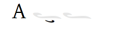
|klasD
|
|klasD
|
|
|

|
|a
|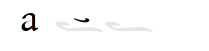
|klasU
|
|klasU
|
|
|

|
|D
|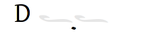
|haplD
|
|haplD
|
|
|Notice that there is no haple for ison/oligon. This haple goes under an apostrofos or hyporroe.

|
|d
|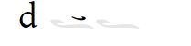
|klasL
|spec_ison-klasU
|klasU
|if after ison or cham
|
|

|
|F
|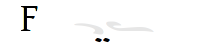
|diplDR
|spec_apos-diplD
|diplD
|if after apos
|
|

|
|f
|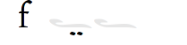
|diplD
|
|diplD
|
|
|

|
|G
|image:ka_fontimages/main-capital-G.png[]
|tripDR
|spec_apos-tripD
|tripD
|if after apos
|
|

|
|g
|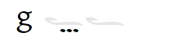
|tripD
|
|tripD
|
|
|

|
|H
|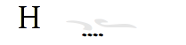
|tetrDR
|spec_apos-tetrD
|tetrD
|if after apos
|
|

|
|h
|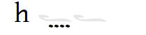
|tetrD
|
|tetrD
|
|
|

|
|J
|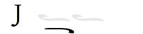
|antiD2
|
|antiD2
|
|
|

|
|j
|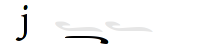
|antiD
|
|antiD
|
|
|

|
|K
|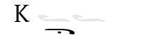
|antiD2-haplD2
|liga_antiD2-haplD2
|antiD2-haplD2
|
|
|

|
|k
|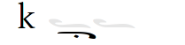
|antiD-haplD
|liga_antiD-haplD
|antiD-haplD
|
|
|

|
|l
|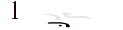
|akaplDR
|spec_apos-antiD-haplD
|antiD-haplD
|if after apos
|
|

|
|M
|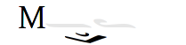
|klasD-psefD2
|spec_peta-klasD-psefD2
|klasD-psefD2
|if after peta
|
|

|
|m
|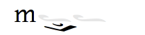
|klasD-psefD2
|liga_klasD-psefD2
|klasD-psefD2
|klasD-psefD2 ligature
|
|Simple ligature for better looking combination of klas and psef

|
|N
|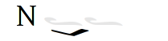
|psefD2
|
|psefD2
|
|
|

|
|n
|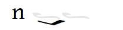
|psefD
|
|psefD
|
|
|

|
|S
|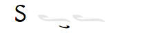
|klasDR
|spec_peta-klasD
|klasDR
|if after peta
|
|

|
|s
|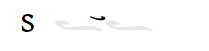
|klasUR
|spec_apos-klasU
|klasUR
|if after apos
|
|

|
|[
|image:ka_fontimages/main-left-bracket.png[]
|heteD
|
|heteD
|
|
|

|
|]
|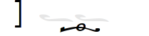
|endoD
|
|endoD
|
|
|

|
|{
|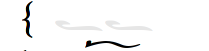
|heteD2
|
|heteD2
|if after peta, olig-kentD, or olig-ken2D
|
|

|
|\|
|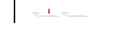
|barlU
|
|barlU
|
|
|Will probably only appear after olig-ken2U, but this isn't a ligature or substitution (must be asked for explicitly).

|
|}
|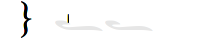
|barlUL
|
|barlU
|barlU if after syne
|
|

|
|~
|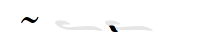
|kent
|
|kent
|
|
|

|
|«
|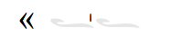
|barlUR
|
|barlUR
|barlU if after apos
|
|This is my best guess at where this came from. Not sure if this is an old leftover neume that should be deleted, or if it was intended to be placed over a specific neume.

|
|å
|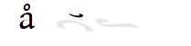
|klasU1.1L0.9
|spec_elaf-klasU
|klasU
|if after elaf, apel, or syne
|
|

|
|ƒ
|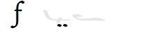
|diplDR1.5
|spec_elaf-diplD
|diplD
|if after elaf, apel, or chame
|
|

|
|˚
|image:ka_fontimages/main-alternate-degree-sign.png[]
|akaplD1.5
|spec_peta-antiD
|antiD
|if after bare-peta
|
|

|
|‘
|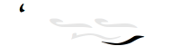
|spsef
|spec_heteD-psefD
|psef
|if after heteD
|
|Seperated from heteD so that hete can be colored red. Note: this is not aligned for heteD2.

|
|“
|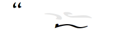
|heteDR2
|spec_apos-heteD
|heteDR2
|if after apos
|
|

|
|”
|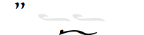
|heteD2
|
|heteD2
|if after olig-kentD or olig-ken2D
|
|

|
|∂
|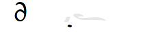
|haplDR
|spec_hypo-haplD
|haplDR
|if after hypo
|
|

|
|'
|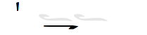
|homaD
|
|homaD
|
|
|

|
|"
|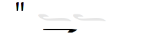
|homaD2
|
|homaD2
|
|
|

|
|:
|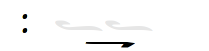
|homaD2R
|
|homaD2R
|
|
|

|
|;
|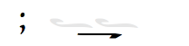
|homaDR
|
|homaDR
|
|
|

|
|B
|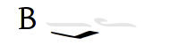
|lpsef
|
|lpsef
|if after long oligon
|
|Long oligon no longer exists for New Stathis. In others fonts could come after neumes like olig-isonUL-ken2UR or olig-aposUL-ken2UR.

|
|C
|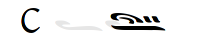
|olig-apelUL-ken2UR
|
|olig-apelUL-ken2UR
|
|
|

|
|E
|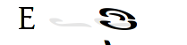
|peta-apelU
|
|peta-apelU
|
|
|

|
|I
|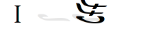
|peta-chamU-chamU2
|
|peta-chamU-chamU2
|
|
|

|
|L
|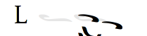
|apo2
|
|apo2
|optional ligature for apos apos
|
|This combination is optional for saving space on a page. Note that this is two consecutive apostrophoi (apos apos), not one base nueme with another below it (apos-aposD).

|
|O
|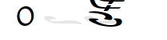
|peta-aposU-chamU2-chamU3
|
|peta-aposU-chamU2-chamU3
|
|
|We haven't planned for 3rd level, but we need it for this combo.

|
|P
|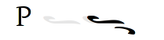
|ison-aposD
|
|ison-aposD
|optional ligature for ison apos
|
|See note for apo2 (apos apos).

|
|Q
|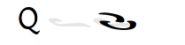
|peta-aposU
|
|peta-aposU
|
|
|

|
|R
|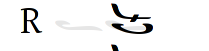
|peta-chamU
|
|peta-chamU
|
|
|

|
|T
|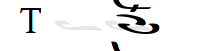
|peta-aposU-chamU2
|
|peta-aposU-chamU2
|
|
|

|
|U
|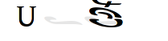
|peta-apelU-chamU2
|
|peta-apelU-chamU2
|
|
|

|
|V
|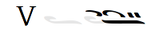
|olig-syneUL-ken2UR
|
|olig-syneUL-ken2UR
|
|
|

|
|W
|
|peta-elafU
|
|peta-elafU
|
|
|

|
|X
|image:ka_fontimages/main-capital-X.png[]
|olig-aposUL-ken2UR
|
|olig-aposUL-ken2UR
|
|
|

|
|Y
|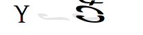
|peta-elafU-chamU2
|
|peta-elafU-chamU2
|
|
|

|
|Z
|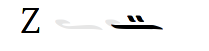
|olig-ken2U
|
|olig-ken2U
|
|
|

|
|b
|image:ka_fontimages/main-b.png[]
|olig-chamUL-ken2UR
|
|olig-chamUL-ken2UR
|
|
|

|
|c
|
|olig-elafUL-ken2UR
|
|olig-elafUL-ken2UR
|
|
|

|
|e
|
|peta-kentU
|
|peta-kentU
|
|
|

|
|i
|
|peta-hypsUL-hypsUR
|
|peta-hypsUL-hypsUR
|
|
|

|
|o
|
|peta-kentU-hypsUR-hypsU2
|
|peta-kentU-hypsUR-hypsU2
|
|
|

|
|p
|
|peta-isonU
|
|peta-isonU
|
|
|

|
|q
|
|peta
|
|peta
|
|
|

|
|r
|
|peta-hypsUR
|
|peta-hypsUR
|
|
|

|
|t
|
|peta-hypsUL
|
|peta-hypsUL
|
|
|

|
|u
|
|peta-kentU-hypsU2
|
|peta-kentU-hypsU2
|
|
|

|
|v
|image:ka_fontimages/main-v.png[]
|olig-hypoUL-ken2UR
|
|olig-hypoUL-ken2UR
|
|
|

|
|w
|
|peta-oligU
|
|peta-oligU
|
|
|

|
|x
|
|olig-isonUL-ken2UR
|
|olig-isonUL-ken2UR
|
|
|

|
|y
|
|peta-kentU-hypsUR
|
|peta-kentU-hypsUR
|
|
|

|
|z
|
|olig-ken2DR
|
|olig-ken2DR
|
|
|This is the standard olig-ken2D.

|
|Ω
|
|olig-ken2D
|liga_olig-ken2D-psefD2
|olig-ken2D
|substitue olig-ken2D for this if psef will follow
|
|Could be combined in TTF as ligature of olig-ken2D-psef, but kept separate for more freedom in coloring.

|
|™
|
|olig-kentDR
|
|olig-kentDR
|
|
|This is the standard olig-kentD.

|
|0
|
|ison
|
|ison
|
|
|

|
|1
|
|olig
|
|olig
|
|
|

|
|2
|
|olig-kentD
|liga_olig-kentD-psefD2
|olig-kentD
|substitute olig-kentD for this if psef will follow
|
|

|
|3
|
|olig-kentU
|
|olig-kentU
|
|
|

|
|4
|image:ka_fontimages/main-4.png[]
|olig-hypsUR
|
|olig-hypsUR
|
|
|

|
|5
|
|olig-hypsUL
|
|olig-hypsUL
|
|
|

|
|6
|
|olig-kentU-hypsUR
|
|olig-kentU-hypsUR
|
|
|

|
|7
|
|olig-kentU-hypsU2
|
|olig-kentU-hypsU2
|
|
|

|
|8
|
|olig-hypsUL-hypsUR
|
|olig-hypsUL-hypsUR
|
|
|

|
|9
|
|olig-kentU-hypsUR-hypsU2
|
|olig-kentU-hypsUR-hypsU2
|
|
|

|
|!
|
|apos
|
|apos
|
|
|

|
|@
|
|elaf
|
|elaf
|
|
|

|
|#
|
|apel
|
|apel
|
|
|technically elaf-aposD, but it's unlikely a font would try to build this manually

|
|$
|
|cham
|
|cham
|
|
|

|
|%
|
|apos-chamU
|
|apos-chamU
|
|
|

|
|^
|
|elaf-chamU
|
|elaf-chamU
|
|
|

|
|&
|
|apel-chamU
|
|apel-chamU
|
|
|

|
|*
|
|cham-chamU
|
|cham-chamU
|
|
|

|
|(
|
|apos-chamU-chamU2
|
|apos-chamU-chamU2
|
|
|

|
|-
|
|hypo
|
|hypo
|
|
|

|
|_
|
|syne
|
|syne
|
|
|

|
|`
|
|ken2
|
|ken2
|
|
|

|
|+
|
|stav
|cros
|stav
|
|
|

|
|=
|
|brea
|
|brea
|
|
|

|
|<
|
|res2
|
|bare-diplR
|
|
|

|
|,
|
|res1
|
|bare-haplR
|
|
|Would this ever need to build this from parts, or can we assume fonts will always have this pre-built?

|
|>
|
|res4
|
|bare-tetrR
|
|
|

|
|.
|
|res3
|
|bare-tripR
|
|
|

|
|/
|
|bare
|
|bare
|
|
|

|
|?
|
|resh
|
|bare-hapl-gorgU
|
|
|

|
|\
|
|barl
|
|barl
|
|
|

|
|
|
|
|
|
|
|
|

|Martyria
|!
|
|mpaU
|
|mpaU
|
|
|

|
|#
|
|mgaU
|
|mgaU
|
|
|

|
|$
|
|mdiU
|
|mdiU
|
|
|

|
|%
|
|mkeU
|
|mkeU
|
|
|

|
|&
|
|mneU
|
|mneU
|
|
|

|
|,
|image:ka_fontimages/martyria-comma.png[]
|chitrig
|
|chi-trigU
|
|
|

|
|/
|
|plag
|
|plag
|
|
|

|
|1
|image:ka_fontimages/martyria-1.png[]
|mpa
|
|mpa
|
|
|

|
|2
|
|mbou
|
|mbou
|
|
|

|
|3
|
|mga
|
|mga
|
|
|

|
|4
|image:ka_fontimages/martyria-4.png[]
|mdi
|
|mdi
|
|
|

|
|5
|
|mke
|
|mke
|
|
|

|
|6
|
|mzo
|
|mzo
|
|
|

|
|7
|
|mne
|
|mne
|
|
|

|
|<
|image:ka_fontimages/martyria-left-caret.png[]
|chitrigU
|
|chiU-trigU2
|
|
|

|
|@
|image:ka_fontimages/martyria-at-sign.png[]
|mbouU
|
|mbouU
|
|
|

|
|A
|
|mbetaU
|
|mbetaU
|
|
|

|
|B
|image:ka_fontimages/martyria-capital-B.png[]
|chigargU
|
|chiU-gargU2
|
|
|Goes above a martyria.

|
|C
|
|chihemiU
|
|chiU-hemiU2
|
|
|Goes above a martyria.

|
|D
|
|mbetaapoU
|
|mbetaU-apoiU2
|
|
|

|
|E
|image:ka_fontimages/martyria-capital-E.png[]
|mnanaU
|
|mnanaU
|
|
|

|
|F
|image:ka_fontimages/martyria-capital-F.png[]
|mscnenaU
|
|mscnenaU
|
|
|

|
|G
|
|mzygosU
|
|mzygosU
|
|
|

|
|H
|image:ka_fontimages/martyria-capital-H.png[]
|mklitonU
|
|mklitonU
|
|
|

|
|I
|
|plfirstmode
|
|malfa-apoiU
|
|
|Ligature for alpha with apostropoi above.

|
|J
|
|mspathiU
|
|mspathiU
|
|
|

|
|M
|image:ka_fontimages/martyria-capital-M.png[]
|chidigoU
|
|chiU-digoU2
|
|
|Goes above a martyria.

|
|N
|image:ka_fontimages/martyria-capital-N.png[]
|chigorgU
|
|chiU-gorgU2
|
|
|Goes above a martyria.

|
|O
|image:ka_fontimages/martyria-capital-O.png[]
|plsecondmode
|
|mbeta-apoiU
|
|
|Ligature for beta with apostrophoi above.

|
|P
|image:ka_fontimages/martyria-capital-P.png[]
|gravemode
|
|grav
|
|
|

|
|Q
|image:ka_fontimages/martyria-capital-Q.png[]
|malfaU
|
|malfaU
|
|
|

|
|R
|
|mdeltaapoU
|
|mdeltU-apoiU2
|
|
|Ligature or delta with apostrophoi above.

|
|S
|
|mnenaU
|
|mnenaU
|
|
|

|
|T
|
|malfaapoU
|
|malfaU-apoiU2
|
|
|Ligature for alpha with apostrophoi above.

|
|U
|image:ka_fontimages/martyria-capital-U.png[]
|mdeltU
|
|mdeltU
|
|
|

|
|V
|
|chiargU
|
|chiU-argoU2
|
|
|Goes above a martyria.

|
|W
|image:ka_fontimages/martyria-capital-W.png[]
|mlamdaU
|
|mlamdaU
|
|
|

|
|X
|
|chidiarU
|
|chiU-diarU2
|
|
|Goes above a martyria.

|
|Y
|image:ka_fontimages/martyria-capital-Y.png[]
|mhypoU
|
|mhypoU
|
|
|

|
|Z
|
|chitriaU
|
|chiU-triaU2
|
|
|Goes above a martyria.

|
|[
|
|fourthmode
|
|mdelt-apoiU-hypsU2
|
|
|Ligature or delta with apostrofoi above.

|
|^
|image:ka_fontimages/martyria-up-caret.png[]
|mzoU
|
|mzoU
|
|
|

|
|`
|image:ka_fontimages/martyria-grave.png[]
|mprim
|
|mprim
|
|
|

|
|a
|
|mbeta
|
|mbeta
|
|
|

|
|b
|
|chigarg
|
|chi-gargU
|
|
|

|
|c
|image:ka_fontimages/martyria-c.png[]
|chihemi
|
|chi-hemiU
|
|
|

|
|d
|image:ka_fontimages/martyria-d.png[]
|mbetaapo
|
|mbeta-apoiU
|
|
|

|
|e
|image:ka_fontimages/martyria-e.png[]
|mnana
|
|mnana
|
|
|

|
|f
|image:ka_fontimages/martyria-f.png[]
|mscnena
|
|mscnena
|
|
|

|
|g
|
|mzygos
|
|mzygos
|
|
|

|
|h
|image:ka_fontimages/martyria-h.png[]
|mkliton
|
|mkliton
|
|
|

|
|i
|
|firstmode
|
|malpha
|
|
|

|
|j
|
|mspathi
|
|mspathi
|
|
|

|
|m
|
|chidigo
|
|chi-digoU
|
|
|

|
|n
|
|chigorg
|
|chi-gorgU
|
|
|

|
|o
|
|secondmode
|
|mbetaapo-mfon
|
|
|Is actually ligature of mbetaapo and U+1D0AF.

|
|p
|
|nana
|
|mnana-isa2U
|
|
|Ligature for mnana with isakia above.

|
|q
|image:ka_fontimages/martyria-q.png[]
|malfa
|
|malfa
|
|
|

|
|r
|
|mdeltaapo
|
|mdelt-apoiU
|
|
|Ligature for delta with apostrophoi above.

|
|s
|image:ka_fontimages/martyria-s.png[]
|mnena
|
|mnena
|
|
|

|
|t
|
|malfaapo
|
|malfa-apoiU
|
|
|Ligature for alpha with apostrophoi above.

|
|u
|
|mdelt
|
|mdelt
|
|
|

|
|v
|image:ka_fontimages/martyria-v.png[]
|chiargo
|
|chi-argoU
|
|
|

|
|w
|image:ka_fontimages/martyria-w.png[]
|mlamda
|
|mlamda
|
|
|

|
|x
|image:ka_fontimages/martyria-x.png[]
|chidiar
|
|chi-diarU
|
|
|

|
|y
|image:ka_fontimages/martyria-y.png[]
|mhypo
|
|mhypo
|
|
|

|
|z
|image:ka_fontimages/martyria-z.png[]
|chitria
|
|chi-triaU
|
|
|

|
|{
|image:ka_fontimages/martyria-left-curly-bracket.png[]
|plfourthmode
|
|deta-apoiU
|
|
|Ligature for delta with apostrophoi above.

|
|~
|image:ka_fontimages/martyria-tilde.png[]
|mprimU
|
|mprimU
|
|
|

|
|π
|image:ka_fontimages/martyria-pi.png[]
|thirdmode
|
|nana-apoiU
|
|
|

|
|“
|
|lege
|
|lege
|
|
|

|
|
|
|
|
|
|
|
|

|Fthora
|!
|
|indpaUR
|
|indpaUR
|
|
|

|
|@
|
|indbouUR
|
|indbouUR
|
|
|

|
|"
|
|sharp2DR
|spec_apos-sharp2D
|sharp2DR
|if after apos
|
|Sharp2 for apostrofos.

|
|#
|image:ka_fontimages/fthora-number-sign.png[]
|indgaUR
|
|indgaUR
|
|
|

|
|$
|
|inddiUR
|
|inddiUR
|
|
|

|
|%
|
|indkeUR
|
|indkeUR
|
|
|

|
|^
|
|indzoUR
|
|indzoUR
|
|
|

|
|&
|
|indneUR
|
|indneUR
|
|
|

|
|'
|
|sharp2D
|
|sharp2D
|
|
|Standard sharp2 for olig, ison, etc.

|
|+
|
|sharpDR
|spec_apos-sharpD
|sharpDR
|if after apos
|
|Sharp for apostrofos.

|
|,
|
|permflatU
|
|permflatU
|
|
|

|
|-
|
|flatU
|
|flatU
|
|
|Standard flat for olig, ison, etc.

|
|.
|
|permsharpU
|
|permsharpU
|
|
|

|
|1
|
|indpaUL
|
|indpaUL
|
|
|

|
|2
|
|indbouUL
|
|indbouUL
|
|
|

|
|3
|
|indgaUL
|
|indgaUL
|
|
|

|
|4
|
|inddiUL
|
|inddiUL
|
|
|

|
|5
|
|indkeUL
|
|indkeUL
|
|
|

|
|6
|
|indzoUL
|
|indzoUL
|
|
|

|
|7
|
|indneUL
|
|indneUL
|
|
|

|
|:
|
|flat2U2R2
|
|flat2U2R2
|if after olig-[ison/apos/elaf]-kenUR
|
|Flat2 for kentemata in olig-ken2R.

|
|;
|
|flat2U
|
|flat2U
|
|
|Standard flat2 for olig, ison, etc.

|
|<
|
|permflatD
|spec_apos-permflatD
|permflatD
|if after apos
|
|

|
|=
|
|sharpD
|
|sharpD
|
|
|Standard sharp for oligon, ison, etc.

|
|>
|
|permsharpD
|spec_apos-permsharpD
|permsharpD
|if after apos
|
|

|
|A
|
|fhcpaDR
|spec_apos-fhcpaD
|fhcpaDR
|if after apos
|
|

|
|D
|
|fscdiDR
|spec_apos-fscdiD
|fscdiDR
|if after apos
|
|

|
|E
|
|fdgaDR
|spec_apos-fdgaD
|fdgaDR
|if after apos
|
|

|
|F
|
|fscnenaDR
|spec_apos-fscnenaD
|fscnenaDR
|if after apos
|
|

|
|G
|
|fzygosDR
|spec_apos-fzygosD
|fzygosDR
|if after apos
|
|

|
|H
|
|fklitonDR
|spec_apos-fklitonD
|fklitonDR
|if after apos
|
|

|
|I
|
|fdneDR
|spec_apos-fdneD
|fdneDR
|if after apos
|
|

|
|J
|
|fspathiDR
|spec_apos-fspathiD
|fspathiDR
|if after apos
|
|

|
|K
|
|fajemDR
|spec_apos-fajemD
|fajemDR
|if after apos
|
|

|
|Q
|
|fdpaDR
|spec_apos-fdpaD
|fdpaDR
|if after apos
|
|

|
|R
|
|fddiDR
|spec_apos-fddiD
|fddiDR
|if after apos
|
|

|
|S
|
|fnenaDR
|spec_apos-fnenaD
|fnenaDR
|if after apos
|
|

|
|T
|
|fdkeDR
|spec_apos-fdkeD
|fdkeDR
|if after apos
|
|

|
|U
|
|fdhineDR
|spec_apos-fdhineD
|fdhineDR
|if after apos
|
|

|
|W
|
|fdbouDR
|spec_apos-fdbouD
|fdbouDR
|if after apos
|
|

|
|Y
|
|fdhizoDR
|spec_apos-fdhizoD
|fdhizoDR
|if after apos
|
|

|
|[
|
|flat1U
|
|flat1U
|
|
|Standard flat1 for olig, ison, etc.

|
|]
|
|sharp1D
|
|sharp1D
|
|
|Standard sharp1 for olig, ison, etc.

|
|_
|image:ka_fontimages/fthora-underscore.png[]
|flatU2R2
|
|flatU2R2
|if after olig-[ison/apos/elaf]-kenUR
|
|Flat for kentemata in olig-ken2R.

|
|a
|
|fhcpaU
|
|fhcpaU
|
|
|

|
|d
|
|fscdiU
|
|fscdiU
|
|
|

|
|e
|
|fdgaU
|
|fdgaU
|
|
|

|
|f
|
|fscnenaU
|
|fscnenaU
|
|
|

|
|g
|
|fzygosU
|
|fzygosU
|
|
|

|
|h
|image:ka_fontimages/fthora-h.png[]
|fklitοnU
|
|fklitοnU
|
|
|

|
|i
|
|fdhineU
|
|fdhineU
|
|
|Diatonic high Ne

|
|j
|
|fspathiU
|
|fspathiU
|
|
|

|
|k
|
|fajemU
|
|fajemU
|
|
|

|
|q
|
|fdpaU
|
|fdpaU
|
|
|

|
|r
|
|fddiU
|
|fddiU
|
|
|

|
|s
|
|fnenaU
|
|fnenaU
|
|
|

|
|t
|
|fdkeU
|
|fdkeU
|
|
|

|
|u
|
|fdhineU
|
|fdhineU
|
|
|

|
|w
|
|fdbouU
|
|fdbouU
|
|
|

|
|y
|
|fdhizoU
|
|fdhizoU
|
|
|

|
|{
|
|flat1U2R2
|
|flat1U2R2
|if after olig-[ison/apos/elaf]-kenUR
|
|Flat1 for kentemata in olig-ken2R.

|
|}
|
|sharp1DR
|spec_apos-sharp1D
|sharp1DR
|if after apos
|
|Sharp1 for apostrofos.

|
|¥
|
|fdhizoUR
|
|fdhizoUR
|
|
|Goes above martyria.

|
|¨
|
|fdhineUR
|
|fdhineUR
|
|
|Goes above martyria.

|
|©
|
|fzygUR
|
|fzygUR
|
|
|Goes above martyria.

|
|®
|
|fddiUR
|
|fddiUR
|
|
|Goes above martyria.

|
|´
|
|fnanaUR
|
|fnanaUR
|
|
|Goes above martyria.

|
|ß
|
|fnenaUR
|
|fnenaUR
|
|
|Goes above martyria.

|
|å
|
|fhcpaUR
|
|fhcpaUR
|
|
|Goes above martyria.

|
|œ
|
|fdpaUR
|
|fdpaUR
|
|
|Goes above martyria.

|
|ƒ
|
|fscnenaUR
|
|fscnenaUR
|
|
|Goes above martyria.

|
|ˆ
|
|fdneUR
|
|fdneUR
|
|
|Goes above martyria.

|
|˚
|
|fajemUR
|
|fajemUR
|
|
|Goes above martyria.

|
|–
|
|flatU2R2
|
|flatU2R2
|???
|
|Not sure what this is for.

|
|†
|image:ka_fontimages/fthora-dagger.png[]
|fdkeUR
|
|fdkeUR
|
|
|Goes above martyria.

|
|∂
|
|fscdiUR
|
|fscdiUR
|
|
|Goes above martyria.

|
|∆
|
|fspathiUR
|
|fspathiUR
|
|
|Goes above martyria.

|
|∑
|
|fdbouUR
|
|fdbouUR
|
|
|Goes above martyria.

|
|≠
|
|sharpD2
|spec_apos2-sharpD
|sharpD2
|if after apos2
|
|Sharp for apos2 ligature.

|
|
|
|
|
|
|
|
|

|Combo
|-
|
|peta-hypoU
|
|peta-hypoU
|
|
|

|
|0
|
|olig-ken2U-hypsUR-hypsU2
|
|olig-ken2U-hypsUR-hypsU2
|
|
|

|
|1
|
|olig-hypsUL-kentU-hypsU2
|
|olig-hypsUL-kentU-hypsU2
|
|
|

|
|2
|image:ka_fontimages/combo-2.png[]
|olig-hypsUL-hypsU-hypsUR
|
|olig-hypsUL-hypsU-hypsUR
|
|
|

|
|3
|
|olig-hypsUL-ken2U-hypsUR-hypsU2
|
|olig-hypsUL-ken2U-hypsUR-hypsU2
|
|
|

|
|4
|
|olig-hypsUL-kentU-hypsUR-hypsU2
|
|olig-hypsUL-kentU-hypsUR-hypsU2
|
|
|

|
|C
|
|olig-apelU
|
|olig-apelU
|
|
|

|
|V
|image:ka_fontimages/combo-capital-V.png[]
|olig-chamU
|
|olig-chamU
|
|
|

|
|X
|image:ka_fontimages/combo-capital-X.png[]
|olig-aposU
|
|olig-aposU
|
|
|

|
|[
|
|diplD-heteD
|
|diplD-heteD
|
|
|

|
|]
|
|tetrD-heteD
|
|tetrD-heteD
|
|
|

|
|_
|
|peta-syneU
|
|peta-syneU
|
|
|

|
|c
|
|olig-petaU
|
|olig-petaU
|
|
|

|
|i
|
|olig-hypsUL-ken2U
|
|olig-hypsUL-ken2U
|
|
|

|
|s
|image:ka_fontimages/combo-s.png[]
|klasU2L
|spec_olig-aposU-klasU2L
|if after olig-aposU
|
|
|

|
|u
|image:ka_fontimages/combo-u.png[]
|olig-ken2U-hypsUR
|
|olig-ken2U-hypsUR
|
|
|

|
|v
|
|olig-hypoU
|
|olig-hypoU
|
|
|

|
|x
|
|olig-isonU
|
|olig-isonU
|
|
|

|
|{
|
|tripD0.9R
|
|tripD-heteD2
|
|
|Ligature of tripD-heteD2. This may never be used because hete is usually colored red.

|
|}
|
|spsefD2
|
|psefD2
|if hapl/dipl/tetr-hete
|
|hete might have slightly different position if coming after hapl, diple, etc., so need special psef for this case.

|
|
|
|
|
|
|
|
|

|Chronos
|,
|
|argoU
|
|argoU
|
|
|Standard argon. Should only be above olig or an olig combo.

|
|.
|
|hemiU
|
|hemiU
|
|
|Standard hemiolion. Should only be above olig or olig combo.

|
|/
|
|diargU
|
|diargU
|
|
|Standard diagron. Should only be above olig or olig combo.

|
|A
|image:ka_fontimages/chronos-capital-A.png[]
|dotdigoU
|
|dotdigoU
|
|
|Standard dot digorgon above oligon, ison, etc.

|
|B
|
|dotgorgU2L
|
|dotgorgU2L
|
|
|Above olig-[hypo/apos/elaf]-ken2UR

|
|C
|
|dotgorgD
|
|dotgorgD
|
|
|Below olig, ison, etc.

|
|D
|image:ka_fontimages/chronos-capital-D.png[]
|dotdigoD
|
|dotdigoD
|
|
|Dotdigorgon below olig, ison, etc.

|
|E
|image:ka_fontimages/chronos-capital-E.png[]
|dottrigD
|
|dottrigD
|
|
|Dotdigorgon below olig, ison, etc.

|
|F
|
|dotdigoUR
|
|dotdigoUR
|if above apos or hypo
|
|

|
|H
|image:
|dotdigoDR
|
|dotdigoDR
|if after apos or hypo
|
|Below apostrophos or hyporroe. Not sure if this combo is ever used in music.

|
|J
|image:
|dotdigoU2R
|
|dotdigoU2R
|
|
|Above olig-[hypo/apos/elaf]-ken2U

|
|M
|
|dotgorgU2R
|
|dotgorgU2R
|
|
|Above olig-[hypo/apos/elaf]-ken2U

|
|N
|
|dotgorgDR
|
|dotgorgDR
|if after apos or hypo
|
|

|
|Q
|image:ka_fontimages/chronos-capital-Q.png[]
|dottrigU
|
|dottrigU
|
|
|Above olig, ison, etc.

|
|R
|image:ka_fontimages/chronos-capital-R.png[]
|dottrigUR
|
|dottrigUR
|if after apos
|
|

|
|S
|
|dotdigoU2
|
|dotdigoU2
|if after olig-ken2U
|
|Should be only dotdigo choice if olig-ken2U.

|
|T
|image:ka_fontimages/chronos-capital-T.png[]
|dottrigU2L
|
|dottrigU2L
|
|
|Above olig-[hypo/apos/elaf]-ken2UR

|
|U
|image:ka_fontimages/chronos-capital-V.png[]
|dottrigU2R
|
|dottrigU2R
|
|
|Above olig-[hypo/apos/elaf]-ken2U

|
|V
|image:ka_fontimages/chronos-capital-V.png[]
|dotgorgUR
|
|dotgorgUR
|if after apos or hypo
|
|

|
|W
|image:ka_fontimages/chronos-capital-W.png[]
|dottrigU2
|
|dottrigU2
|if after olig-ken2U
|
|Should be only dottrig choice if olig-ken2U.

|
|X
|
|dotgorgU2
|
|dotgorgU2
|if after olig-ken2U
|
|Should be only dotgorg choice if olig-ken2U.

|
|Y
|image:ka_fontimages/chronos-capital-Y.png[]
|dottrigDR
|
|dottrigDR
|if after apos or hypo
|
|Below apostrophos or hyporroe.

|
|Z
|
|dotgorgU
|
|dotgorgU
|
|
|Above oligon, ison, etc.

|
|\
|image:ka_fontimages/chronos-backslash.png[]
|koroU
|
|koroU
|
|
|

|
|?
|image:ka_fontimages/chronos-backslash.png[]
|koroUR
|
|koroUR
|
|if after apostrophos
|Centered above apostrophos.

|
|a
|
|digoU
|
|digoU
|
|
|Above olig, ison, etc.

|
|b
|image:ka_fontimages/chronos-b.png[]
|gorgU2L
|
|gorgU2L
|
|
|Above olig-[hypo/apos/elaf]-ken2UR

|
|c
|image:ka_fontimages/chronos-c.png[]
|gorgD
|
|gorgD
|
|
|Gorgon below olig, ison, etc.

|
|d
|image:ka_fontimages/chronos-d.png[]
|digoD
|
|digoD
|
|
|Digorgon below olig, ison, etc.

|
|e
|image:ka_fontimages/chronos-e.png[]
|trigD
|
|trigD
|
|
|Trigorgon below olig, ison, etc.

|
|f
|
|digoUR
|
|digoUR
|if above apos or hypo
|
|

|
|g
|image:ka_fontimages/chronos-g.png[]
|digoU2L
|
|digoU2L
|
|
|Above olig-[hypo/apos/elaf]-ken2UR

|
|h
|image:ka_fontimages/chronos-h.png[]
|digoDR
|
|digoDR
|if after apos or hypo
|
|Below apostrophos or hyporroe. Not sure if this combo is ever used in music.

|
|j
|image:ka_fontimages/chronos-j.png[]
|digoU2R
|
|digoU2R
|
|
|Above olig-[hypo/apos/elaf]-ken2U

|
|m
|
|gorgU2R
|
|gorgU2R
|
|
|Above olig-[hypo/apos/elaf]-ken2U

|
|n
|
|gorgDR
|
|gorgDR
|if after apos or hypo
|
|Below apostrophos or hyporroe.

|
|q
|image:ka_fontimages/chronos-q.png[]
|trigU
|
|trigU
|
|
|Above oligon, ison, etc.

|
|r
|image:ka_fontimages/chronos-r.png[]
|trigUR
|
|trigUR
|if after apos
|
|Trigorgon above apostrophos.

|
|s
|
|digoU2
|
|digoU2
|if after olig-ken2U
|
|Should be only digorgon choice if olig-ken2U.

|
|t
|image:ka_fontimages/chronos-t.png[]
|trigU2L
|
|trigU2L
|
|
|Above olig-[hypo/apos/elaf]-ken2UR

|
|u
|image:ka_fontimages/chronos-u.png[]
|trigU2R
|
|trigU2R
|
|
|Above olig-[hypo/apos/elaf]-ken2U

|
|v
|image:ka_fontimages/chronos-v.png[]
|gorgUR
|
|gorgUR
|if after apos
|
|Above apostrophos.

|
|w
|image:ka_fontimages/chronos-w.png[]
|trigU2
|
|trig
|if after olig-ken2U
|
|Should be only trigorgon choice if olig-ken2U.

|
|x
|
|gorgU2
|
|gorgU2
|if after olig-ken2U
|
|Should be only gorgon choice if olig-ken2U.

|
|y
|image:ka_fontimages/chronos-y.png[]
|trigDR
|
|trigDR
|if after apos or hypo
|
|Below apostrophos or hyporroe.

|
|z
|
|gorgU
|
|gorgU
|
|
|Above oligon, ison, etc.

|
|\|
|image:ka_fontimages/chronos-pipe.png[]
|hyfeU
|
|
|
|
|Standard hyphen.

|
|å
|image:ka_fontimages/chronos-a-ring.png[]
|digodotU
|
|digodotU
|
|
|Digorgon below oligon, ison, etc.

|
|∫
|
|gorgdotU2L
|
|gorgdotU2L
|
|
|Above olig-[hypo/apos/elaf]-ken2UR

|
|ç
|
|gorgdotD
|
|gorgdotD
|
|
|Gorgon below oligon, ison, etc.

|
|∂
|image:ka_fontimages/chronos-derivative.png[]
|digodotD
|
|digodotD
|
|
|

|
|´
|image:ka_fontimages/chronos-acute.png[]
|trigdotD
|
|trigdotD
|
|
|

|
|ƒ
|
|digodotR
|
|digodotR
|
|
|

|
|©
|image:ka_fontimages/chronos-copyright.png[]
|digodotU2L
|
|digodotU2L
|
|
|

|
|˙
|image:ka_fontimages/chronos-dot.png[]
|digodotDR
|
|digodotDR
|
|
|

|
|∆
|image:ka_fontimages/chronos-dot.png[]
|digodotU2R
|
|digodotU2R
|
|
|

|
|μ
|image:ka_fontimages/chronos-mu.png[]
|gorgdotU2R
|
|gorgdotU2R
|
|
|Above olig-[hypo/apos/elaf]-ken2U

|
|˜
|image:ka_fontimages/chronos-small-tilde.png[]
|gorgdotDR
|
|gorgdotDR
|if after apos or hypo
|
|Below apostrophos or hyporroe.

|
|œ
|
|trigdotU
|
|trigdotU
|
|
|

|
|®
|
|trigdotUR
|
|trigdotUR
|
|
|

|
|ß
|
|digodotU2
|
|digodotU2
|
|
|

|
|†
|image:ka_fontimages/chronos-dagger.png[]
|trigdotU2L
|
|trigdotU2L
|
|
|

|
|¨
|image:ka_fontimages/chronos-diaeresis.png[]
|trigdotU2R
|
|trigdotU2R
|
|
|

|
|√
|
|gorgdotUR
|
|gorgdotUR
|if after apos
|
|Above apostrophos.

|
|∑
|
|trigdotU2
|
|trigdotU2
|
|
|

|
|≈
|image:ka_fontimages/chronos-almost-equal.png[]
|gorgdotU2
|
|gorgdotU2
|if after olig-ken2U
|
|Should be only gorgon choice if olig-ken2U.

|
|¥
|image:ka_fontimages/chronos-yen.png[]
|trigdotDR
|
|trigdotDR
|
|
|

|
|Ω
|image:ka_fontimages/chronos-capital-omega.png[]
|gorgdotU
|
|gorgdotU
|
|
|Above oligon, ison, etc.

|
|
|
|
|
|
|
|
|

|Archaia
|!
|image:ka_fontimages/archaia-exclamation-point.png[]
|oxei-aposU
|
|oxei-aposU
|
|
|

|
|#
|image:ka_fontimages/archaia-number-sign.png[]
|oxei-apelU
|
|oxei-apelU
|
|
|

|
|$
|image:ka_fontimages/archaia-dollarsign.png[]
|oxei-chamU
|
|oxei-chamU
|
|
|

|
|.
|image:ka_fontimages/archaia-period.png[]
|syna
|
|syna
|
|
|

|
|0
|image:ka_fontimages/archaia-0.png[]
|oxei-isonU
|
|oxei-isonU
|
|
|

|
|1
|image:ka_fontimages/archaia-1.png[]
|oxei
|
|oxei
|
|
|

|
|2
|
|oxei-kentD
|
|oxei-kentD
|
|
|

|
|3
|
|oxei-kentU
|
|oxei-kentU
|
|
|

|
|4
|image:ka_fontimages/archaia-4.png[]
|oxei-hypsUR
|
|oxei-hypsUR
|
|
|

|
|5
|
|oxei-hypsUL
|
|oxei-hypsUL
|
|
|

|
|6
|image:ka_fontimages/archaia-6.png[]
|oxei-kentU-hypsUR
|
|oxei-kentU-hypsUR
|
|
|

|
|7
|
|oxei-kentU-hypsU2
|
|oxei-kentU-hypsU2
|
|
|

|
|8
|
|oxei-hypsUL-hypsUR
|
|oxei-hypsUL-hypsUR
|
|
|

|
|9
|
|oxei-kentU-hypsUR-hypsU2
|
|oxei-kentU-hypsUR-hypsU2
|
|
|

|
|@
|
|oxei-elafU
|
|oxei-elafU
|
|
|

|
|A
|
|oldklasD
|
|oldklasD
|
|
|

|
|B
|image:ka_fontimages/archaia-capital-B.png[]
|
|
|
|after long oligon
|
|

|
|C
|image:ka_fontimages/archaia-capital-C.png[]
|oxei-apelUL-ken2UR
|
|oxei-apelUL-ken2UR
|
|
|

|
|L
|image:ka_fontimages/archaia-capital-L.png[]
|lygiD
|
|lygiD
|
|
|

|
|M
|image:ka_fontimages/archaia-capital-M.png[]
|
|
|
|
|
|delete?, copied from Main font

|
|N
|
|opsefD2
|
|opsefD2
|for oxeia
|
|

|
|P
|
|isakU
|
|isakU
|
|
|extra isaki, position should be determined by someone who uses old notation

|
|S
|
|oldklasDR
|
|oldklasDR
|after apos
|
|

|
|V
|
|oxei-syneUL-ken2UR
|
|oxei-syneUL-ken2UR
|
|
|

|
|X
|image:ka_fontimages/archaia-capital-X.png[]
|oxei-aposUL-ken2UR
|
|oxei-aposUL-ken2UR
|
|
|

|
|Z
|image:ka_fontimages/archaia-capital-Z.png[]
|oxei-ken2U
|
|oxei-ken2U
|
|
|

|
|[
|
|tromD
|
|tromDR
|
|
|

|
|]
|
|ekstD
|
|ekstD
|
|
|

|
|a
|image:ka_fontimages/archaia-a.png[]
|oldklasU
|
|oldklasU
|
|
|

|
|b
|
|oxei-chamUL-ken2UR
|
|oxei-chamUL-ken2UR
|
|
|

|
|c
|image:ka_fontimages/archaia-c.png[]
|oxei-elafUL-ken2UR
|
|oxei-elafUL-ken2UR
|
|
|

|
|d
|
|oldklasUR0.1
|
|oldklasUR0.1
|
|
|needed?

|
|l
|image:ka_fontimages/archaia-l.png[]
|lygiDL
|
|lygiDL
|
|
|

|
|m
|image:ka_fontimages/archaia-m.png[]
|opsklas
|
|klasD-psefD2
|for oxeia only
|
|

|
|n
|
|opsef
|
|opsefD
|psef for oxeia
|
|

|
|p
|
|isakUL1.1
|
|isakUL1.1
|
|
|

|
|s
|
|oldklasUR
|
|oldklasUR
|above apos
|
|

|
|v
|
|oxei-hypoUL-ken2UR
|
|oxei-hypoUL-ken2UR
|
|
|

|
|x
|
|oxei-isonUL-ken2UR
|
|oxei-isonUL-ken2UR
|
|
|

|
|z
|image:ka_fontimages/archaia-z.png[]
|oxei-ken2DR
|
|oxei-ken2DR
|
|
|

|
|{
|image:ka_fontimages/archaia-left-curly-bracket.png[]
|tromDR
|
|tromDR
|after apos
|
|

|
|\|
|
|pias
|
|pias
|
|
|

|
|~
|image:ka_fontimages/archaia-tilde.png[]
|kentU0.1
|
|kentU0.1
|
|
|I don't think this can ever be used. I should delete this from the TTF.

|
|Ω
|
|oxei-ken2D-psefD2
|
|oxei-ken2D-psefD2
|only used with psefiston
|
|

|
|™
|
|oxei-kentDR-psefD2
|
|oxei-kentDR-psefD2
|only used with psefiston
|
|

|===
